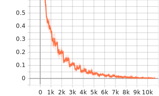

# NLP-KB
> [!IMPORTANT]
> 概要：**构建知识图谱的 PipeLine**


📢 **通知**

* 预训练 bert-large-uncased(For 关系抽取)在 [Link](https://drive.google.com/file/d/1uVyGTZYOURnM-N-nvvuD3ZUHRC5Aln0n/view?usp=sharing) 可以获取到
* 中文的 webui 使用视频已经发布到 b 站: [Link](https://www.bilibili.com/video/BV1f3gveUEZK/)
* 完成了简单的 `webui` 的部署 ，使用 `python -m app.py` 即可


😶‍🌫️ **TODO**: 更换分句模型
<br/>

----


## 0. 环境安装

建议使用 `Python` >= 3.10，注意 `gradio` 使用最新版的，老旧版本已经被验证可能会出现**无限递归**的错误(暂不清楚原因)

使用如下命令开始安装依赖：

```shell
pip install -r requirements.txt
pip install torch_scatter
```

需要指出：

* `nltz` 库下载模型需要足够流畅的网络[TODO 之后考虑换一个分句模型]

<br/>
<br/>

## 1. 数据与模型下载

"Harry Pottle" in Wikipedia. 

**如果网络流畅，可以跳过模型下载这一步**。

> 如果你希望训练自己的关系抽取模型，那么需要进行 step1 & step2
>
> 如果你只是想体验关系抽取推理，那么只需要进行 step3

**Step1**. 下载 NER 模型，放置到 `/models/bert-large-ner` 目录，请将仓库 dslim/bert-large-NER 的文件放在里面，而不是文件夹

```bash
git clone https://huggingface.co/dslim/bert-large-NER
```

建议使用 SSH 下载，可能会更加稳定✨


**Step2**. 下载预训练 BERT 模型，放置到 `/models/bert-large-uncased` 目录，要求同 step1.

```bash
git clone https://huggingface.co/google-bert/bert-large-uncased
```

 **Step3**. 下载 Babelscape/rebel-large 仓库模型，放置到 `/models/rebel` 目录，要求同 step1.

```bash
git clone https://huggingface.co/Babelscape/rebel-large
```

<br/>
<br/>

## 2. 实体关系抽取

**NER**

直接使用 https://huggingface.co/dslim/bert-base-NER 的成品，详细细节在 `/bin/ner.py`
<br/>

**ERE**

使用数据集 [Tacred](https://nlp.stanford.edu/projects/tacred/) 对于 BERT 进行微调，采取最简单的编码方式，然后利用 **[CLS]** Token
$$\rm \[E1\] \mbox{ SUBJ } \[/E1\] \mbox{ ... }\[E2\]\mbox{ ... }\[/E2\]$$

关于数据集形式，我们期望训练集 `train.txt` 包含：

```
{"token": ["Zagat", "Survey", ",", "the", "guide", "empire", "that", "started", "as", "a", "hobby", "for", "Tim", "and", "Nina", "Zagat", "in", "1979", "as", "a", "two-page", "typed", "list", "of", "New", "York", "restaurants", "compiled", "from", "reviews", "from", "friends", ",", "has", "been", "put", "up", "for", "sale", ",", "according", "to", "people", "briefed", "on", "the", "decision", "."], "h": {"name": "Zagat", "pos": [0, 1]}, "t": {"name": "1979", "pos": [17, 18]}, "relation": "org:founded"}
```
<br/>

> [!TIP]
> **数据增强**

鉴于在目标数据集上，需要抽取的关系与 `Tacred` 数据集不完全一致，考虑加入新的关系：

* `per:is_good_at`， `per:write`，`per:friend_of`，`per:enemy_of`

新增数据的获取可以考虑使用 ChatGpt 以及 llama ，例如 prompt 设计为：

```
按照这种格式：{"token": ["The", "African", "Prosecutors", "Association", "was", "founded", "in", "August", "2004", "in", "Maputo", ",", "the", "capital", "of", "Mozambique", ",", "under", "the", "theme", "``", "Africa", "United", "Against", "Crime", ".", "''"], "h": {"name": "African Prosecutors Association", "pos": [1, 4]}, "t": {"name": "August 2004", "pos": [7, 9]}, "relation": "org
"}
为我生成 100 条关系 "per:friend_of" 的训练语料
```

<br/>

> [!TIP]
> **训练流程**

* 使用 `/data/ere_data/data_utils.py` 的 `get_ere_data` 处理
  * **config** 中指定的 Tacred 数据集的训练集和测试集
  * 处理后的结果为 **config** 中的 `train_ner` 与 `val_ner` 字段下的文件
* 然后运行 `ere.py` 进行训练

在 A5000 上设置参数：

* `batch_size` ：128

训练将近 3 h，训练集上的损失变化曲线为：

<div align="center">
  
</div>

<br/>

**如何提取关系**

详情参考 `/bin/extract.py` ，提供了两种输入

```bash
python /bin/extraxt.py --sentence "Harry Pottle is a friend of Joy."
python /bin/extract.py --article [PATH/TO/YOUR/TXT]
```

提取结果为类似如下的输出：

```
Harry Potter	per:origin	British
```

extract.py 的结果 70% 概率输入到 `train_gcn.txt` ，30% 概率输入到 `val_gcn.txt` 用于 R-GCN 模型的训练集和验证集

<br/>


> [!TIP]
> **知识表示和推理**

采用 [Modeling Relational Data with Graph Convolutional Networks](https://arxiv.org/abs/1703.06103) 提出的 R-GCN 获得实体节点的向量嵌入。

<br/>

**数据处理**

保证 `train/val_gcn.txt` 的内容为(每行各个词以 \t 分隔)：

```
Harry Potter	per:origin	British
J. K . Rowling	per:origin	British
Harry Potter	per:schools_attended	Ron Weasley
...
```

之后调用 `data/gcn_data/data_utils.py` 即可获得 `entities.json`，`relations.json`，`train.txt` ，`valid.txt`

<br/>


**训练**

直接调用 `/bin/rgcn.py` 即可，需要注意的参数为 `batch_size` (每次从图中选多少点作为子集进行训练).

<br/>


**推理**

`/bin/interface.py` 提供了 `Interface`类的 $3$ 个成员函数：

* **use_2entitys_to_get_relation** 
  * 接受 `(entity1, entity2)` 的输入，期望的 `entity1` 是原始的表达，比如 "Harry".
* **use_entity1_plus_relation_to_get_relation**
  * 接受 `(entity1, relation)` 的输入，期望的 `ralation` 是原始的表达，比如 "per:friend_of"
* **use_entity2_plus_relation_to_get_relation** 
  * 使用方法同上

> 方法 1 ，暴力所有关系，构成一个关系三元组送入 RGCN 分类器，取 DisMult 分值 > 0.2 的三元组
>
> 方法 2 & 3，首先通过 BFS 搜索，获得与当前实体之间最短路径不超过 `lim_edge=2` 条边的点，接着与方法 1 一样，为候选三元组打分。

<br/>
<br/>


## 4. 数据存储及可视化

为了简化实验，我们只提供了使用 `/bin/neo.py` 对于指定目录(比如 `/data/gcn_data`)下 的 `train_gcn.txt` 以及 `val_gcn.txt` 的三元组，生成得到 `neo4j` 支持的 `Cypher` 语言，您可以在你的浏览器的界面粘贴这些指令以获取结果。

<br/>

<br/>


## 5. UI

为了方便使用😎，这里部署了`webui`，可以使用如下命令 ：

```shell
Python -m app
```


